#  🛸블록체인을 활용한 메타버스 보팅 플랫폼🛸
#### VMG-PUB - Voting Metabus Game Platform Using Blockchain
* [팀 노션 바로가기][notionlink]

[notionlink]: https://www.notion.so/VMG-PUB-Voting-Metaverse-Game-Platform-Using-Blockchain-d76ebc92351e4cd287aa455026129300

* [프로그램 체험하기][gamelink]

[gamelink]: https://dlrkdmsdkdldnavercom.itch.io/testing45

## 1. 프로그램 소개
가상세계에서 블록체인을 활용한 투표를 통해 보다 공정한 투표를 진행하고 이러한 투표나 설문조사의 사람들의 참여를 증진시키기 위한 간단하고 재미있는 게임을 통해 사용자들의 호기심 유발과 투표를 장려한다.
### 기술 스택
------------------------------------

 
 
 
 

### 일정관리: 
   
### 프로그램 화면 
------------------------
* 로그인 화면    

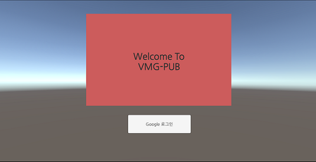

* 캐릭터 선택창 화면

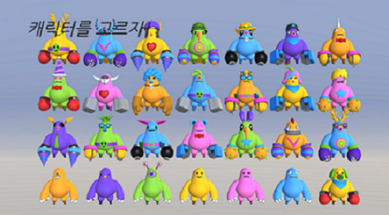

* 닉네임 입력

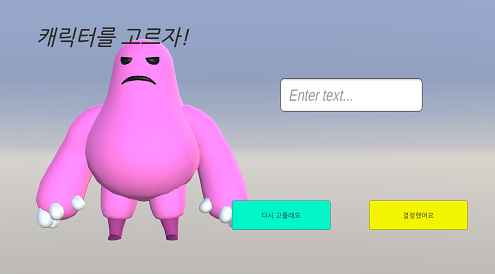

* 광장

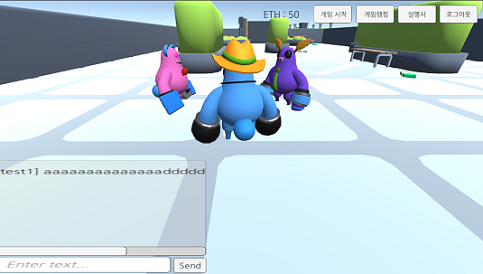

* 미니게임

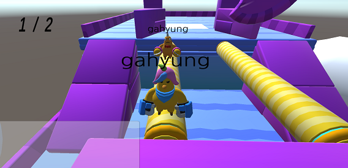

* 보팅룸

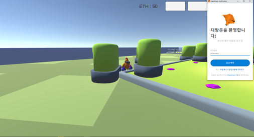

## 2.시스템 구성도

## 3.시스템 상세 구성도
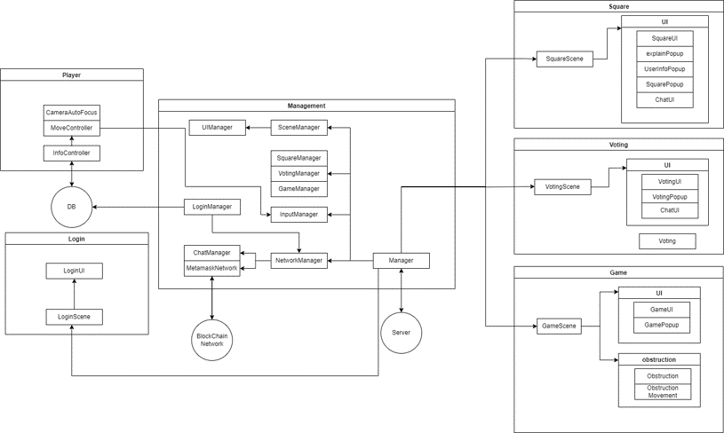

## 4. 깃 커밋 규칙
> ### 커밋 유형
> + FEAT : 새로운 기능 추가
> + FIX : 버그 수정
> + DOCS : 문서 수정
> + REFACTOR : 코드 리팩토링
> + TEST : 테스트 코드 추가
### 1. 커밋 유형 지정
### 2. 제목 행을 50자로 제한
### 3. 제목 행의 첫글자는 대문자로 시작
### 4. 제목 행에 명령문을 사용한다.   
   

## 5. 팀원
| name | 김호현 | 박상문 | 이가형 | 장해식| 
|:---:|:------:|:-----:|:-----:|:-----:|
|profile|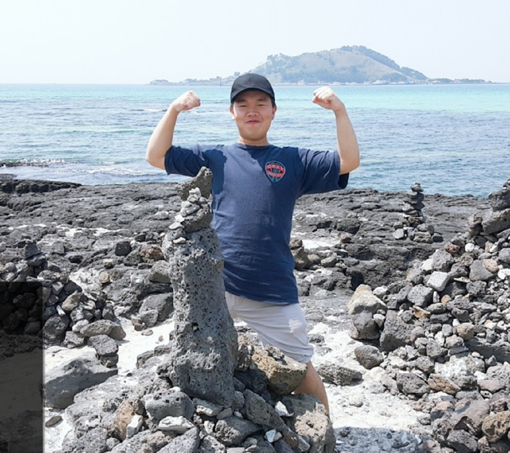 |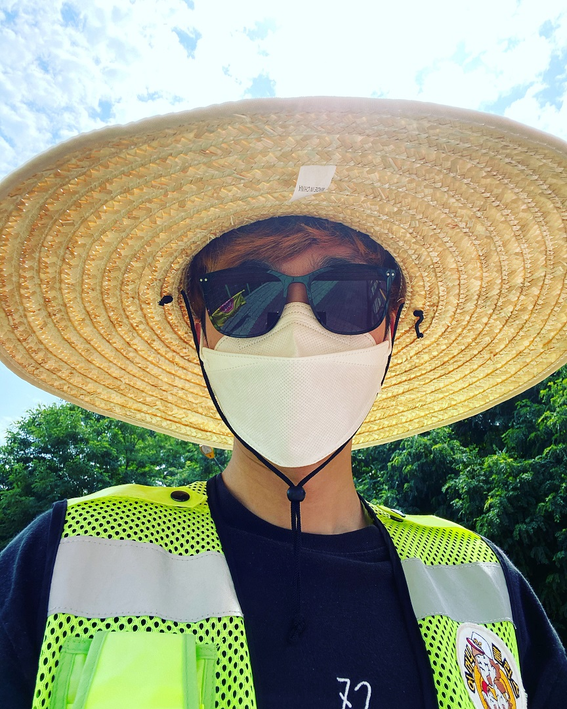 |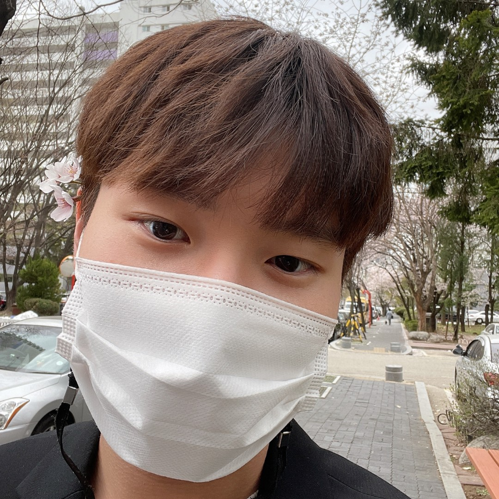 | 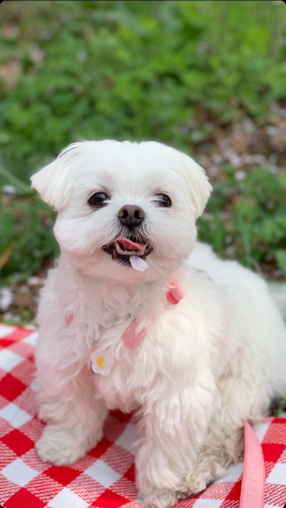|
|role|팀 리더 , 블록체인|유니티, 미니게임, 광장 | 데이터베이스 | 채팅 , 서버
|github|[@hohyun][hoholink]|[@sangmun][Pimlink]|[@gahyung][glink]|[@haesik][hlink]|

[hoholink]: https://github.com/HohyunKim-kr
[Pimlink]: https://github.com/tkdans7589
[glink]: https://github.com/dlrkdmsdkdld
[hlink]: https://github.com/gotlr98

## 6. 저작권
## 이 프로그램의 저작권은 각 팀원에 귀속됩니다.